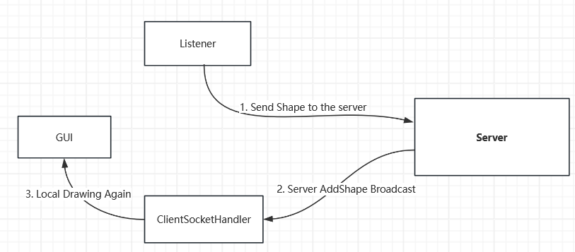

# Shared White Board

### Introduction

This project was partially improved based on the course assignments. This project focuses on enabling different users to coordinate remote operations on the same drawing board. It achieves the coordination and synchronization of drawing information through distributed and concurrent technologies.

### Structure of The Repo

├── src/   # source of the project

└── README.md

### System Architecture

The system adopts a **server-client** architecture:

- The server and the client communicate one-to-one through messages. 
- The client sends the messages to the server and the server broadcasts them to achieve one-to-many communication.

### **Class and Interaction Design**

##### Server

 **RimProcessorImp.java**

The RMI logical implementation class is responsible for adding image data to the server and broadcasting it after receiving client requests.

**ServerProcessor.java**

The core logic processing class of the server is responsible for parsing and processing the JSON data sent by the client, and generating the response JSON to be handed over to ServerSocketHandler.java.

**ServerListeners**

The Listeners of various image types in the server are responsible for first adding the confirmed images to the local server and then broadcasting them to all users via ServerSocketHandler.

**ServerSocketHandler.java**

The server's Socket implementation class, based on Java NIO and the Socket protocol, effectively receives and sends JSON format messages: 

- Receiving user messages for a specific Channel
- Single-point communication to a single user through a specific channel.
- Broadcast to all users

##### Client

 **RimProcessor.java**

The client, based on the **RM**I protocol, obtained and invoked a specific method on the server through the RmiProcessor interface.

**ClientProcessor.java**

ClientProcessor.java is  core logic processing class of the client. It  is responsible for parsing and processing the JSON data sent by the client, and generating the response JSON to be handed over to ClientSocketHandler.java. This is mainly manifested on the client side as receiving and parsing various update information sent by the server to achieve synchronization with the server including: 

-  Adding new images 
-  Receiving the new user list within the server 
-  Receiving and processing the kicked-out information 
-  Receiving and adding new chat information

**ClientListeners**

The Listeners of various image types in the server are responsible for sending the image to the server via RMIProcessor. . 

**ClientrSocketHandler.java**

The client's Socket implementation class, based on Java NIO and the Socket protocol, effectively receives and sends JSON format messages: 

- Single-point communication to the server through a specific channel.
- Receive single-point communication from the server through the client's SocketChannel.

### Communication Protocols  And Message Formats

#### Client to Server

- The client sends the join request to the server in **JSON** format via the **TCP**-based **Socket** protocol.
- After successfully establishing the connection and logging in, the client uses **RMI** to call some methods on the server to achieve the drawing of graphics and the input of chat messages.

#### Server to client

The server mainly uses the TCP Socket system to transmit JSON-formatted messages to notify the client including：

- Point-to-point message:  For example, notifying users that they have been kicked out by the administrator.
- Broadcast: Notify all users of newly added / kicked-out users, newly added graphics, and newly received chat messages

#### Message Formats

#### RMI

**RMI** mainly achieves information input through method invocation, and the message format is in the form of input parameters for the methods.

#### Socket

Based on **TCP**, the **Socket** mainly transmits messages in JSON format. The JSON mainly includes the following elements：

- "Type":

  - "join":  Client application to join

  - "kick": A certain client was kicked out by the administrator.

  - "denyJoin":  A certain client was denied access by the administrator.

  - "addShape":  Notify all clients to add an image

  - "updateUser": Inform all clients to accept the updated list of users

  - "addChatMsg": Notify all clients to add a chat message

  - "serverQuit":  Inform all clients that the server is offline.

  - "clientQuit":  Notify the server that a certain client has gone offline.

    

- Other elements required for executing message processing

  - "Username": The username of the user who requests to join
  - "Users": Updated user list
  - "Shape": The Shape that needs to be added
  - "Msg": The Chat message that needs to be added

###  New Innovations

#### NIO Socket

The **connection management modules** of both the client and the server adopt a single-threaded
polling (**SocketSelector**) approach to monitor each **SocketChannel**.

**SocketChannel**  is a non-blocking way to read from sockets, identified by the server IP address and the port number.

**SocketSelector** monitors the recorded socket channels and serializes the  requests, which the server has to satisfy. The Keys describe the objects used by the selector to sort the requests. Each key represents a single client sub-request and contains information to identify the client and  the type of the request. With non-blocking I/O, someone can program  networked applications to handle multiple simultaneous connections  without having to manage multiple thread collection,

This mode has been proven to be a reliable way to manage connections in a multi-threaded environment in some software (such as Redis).

#### Low-latency image display

When I first designed the image drawing process for the Server-Client model, my primary concern was the data synchronization between the server and the client. Specifically, I wanted the client to

1. Client send the shape data to the server first
2. Only after the user would receive the updated data from the server, it would draw the graphics locally.

However, this design will cause a noticeable delay between the user completing the image drawing and the image appearing on the Board. This is not what the user expects. Thus I have adjusted the drawing process to the structure shown in the following figure:

1. The client draws the image on the local Board (but the data of this drawing is only kept as temporary data on the drawing board and will not be truly stored in the client).
2. Client send the shape data to the server first
3. After the user would receive the updated data from the server, it would  actually add new shape data to the client storage and redraw the Board.

This form can not only display the image drawn by the user in a timely manner, but also synchronize well based on the feedback data from the server (that is, if the server fails to write the data correctly, the client will also refresh and remove the temporarily added data on the Board).

